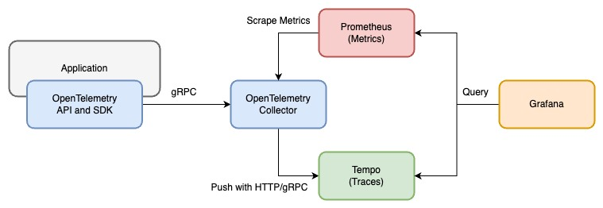
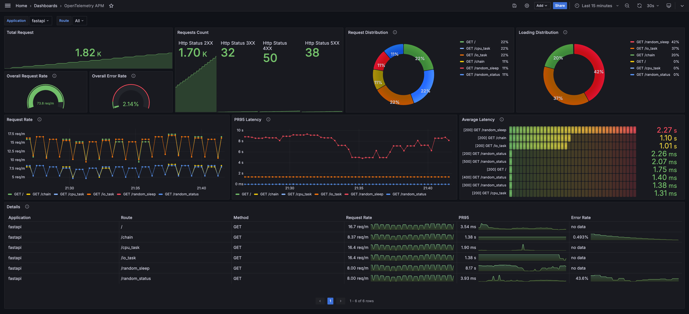
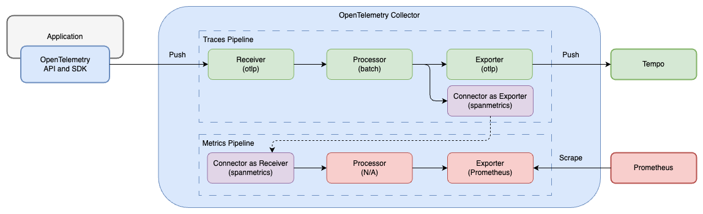
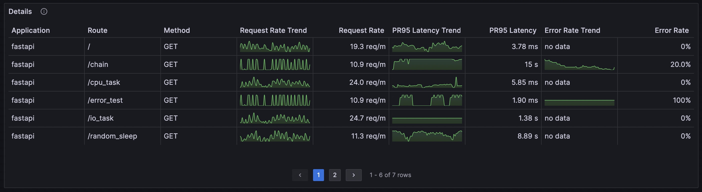

# Observability with Otel Collector

Monitoring application performance with OpenTelemetry SDK, OpenTelemetry Collector, Prometheus, and Grafana:

1. OpenTelemetry SDK: Generate traces and push them to OpenTelemetry Collector with [zero-code instrumentation](https://opentelemetry.io/docs/concepts/instrumentation/zero-code/)
2. OpenTelemetry Collector: Receive traces and process them to metrics with [Span Metrics Connector](https://github.com/open-telemetry/opentelemetry-collector-contrib/blob/main/connector/spanmetricsconnector/README.md)
3. Prometheus: Scrape metrics from OpenTelemetry Collector
4. Grafana: Visualize metrics
5. Tempo: Collect traces, optional for the main goal to process traces to metrics

Note: I have not included logs in this project. For logs you can configure logger in every service and set the Otel Collector yaml file to scrape those logs.

## Kick Start

This is a demo project setup which can be used a blueprint for setting up Observability on a wide K8 Cluster containing multiple services.
Steps:

- Each service is instrumented with required Libraries.
- Certain set of built-in environemnt variables are set for every service. They are responsible for exporting of logs, traces and metrics
- OtelCollector is configured to scrape them from every service, it is deployed as a Pod in itself.
- In OtelCollector, tools like Loki, Prometheus and Tempo are configured.
- They are added as Data Sources in Grafana and configured appropriately to have proper correlation

I have referred to this resource : https://opentelemetry.io/docs/demo/architecture/




## Quick Start

1. Start all services with docker-compose

   ```bash
   docker-compose up -d
   ```

   This project includes FastAPI(Python) and Spring Boot(Java) to demonstrate the out-of-the-box ability of OpenTelemetry zero-code instrumentation. Comment out the services you don't want to run in `docker-compose.yml`.

2. Send requests with [siege](https://linux.die.net/man/1/siege) to the applications:

   ```bash
   bash request-script.sh
   ```

   Or you can send requests with [k6](https://k6.io/):

   ```bash
   k6 run --vus 3 --duration 300s k6-script.js
   ```

3. Login to Grafana([http://localhost:3000/](http://localhost:3000/)) with default admin user and check the predefined dashboard `OpenTelemetry APM`

   - Username: `admin`
   - Password: `admin`

   Dashboard screenshot:

   

   This dashboard is also available on [Grafana Dashboards](https://grafana.com/grafana/dashboards/19419).

## Detail

### OpenTelemetry Zero Instrumentation

OpenTelemetry provides two ways to instrument your application:

1. [Code-based Instrumentation](https://opentelemetry.io/docs/concepts/instrumentation/code-based/): Modify the application codebase to create spans and export them.
2. [Zero-code Instrumentation](https://opentelemetry.io/docs/concepts/instrumentation/zero-code/): Utilize the mechanism from the language runtime to inject code into the application to create spans and export them without modifying the application codebase.

In this project, we use zero-code instrumentation to instrument the applications.


#### Python - FastAPI

For using zero-code instrumentation, we need to install at least three packages:

1. [opentelemetry-distro](https://github.com/open-telemetry/opentelemetry-python-contrib/tree/main/opentelemetry-distro): OpenTelemetry API and SDK
2. [opentelemetry-exporter](https://github.com/open-telemetry/opentelemetry-python/tree/main/exporter): Exporter for traces and metrics which have to correspond to the exporter setting of the agent, we use [opentelemetry-exporter-otlp](https://github.com/open-telemetry/opentelemetry-python/tree/main/exporter/opentelemetry-exporter-otlp) here
3. [opentelemetry-instrumentation](https://github.com/open-telemetry/opentelemetry-python-contrib/tree/main/instrumentation): Provides instrumentation for various libraries and frameworks. There are two methods for installation:
   1. Direct installation of the instrumentation package, for example, [opentelemetry-instrumentation-fastapi](https://github.com/open-telemetry/opentelemetry-python-contrib/tree/main/instrumentation/opentelemetry-instrumentation-fastapi), [opentelemetry-instrumentation-requests](https://github.com/open-telemetry/opentelemetry-python-contrib/tree/main/instrumentation/opentelemetry-instrumentation-requests), [opentelemetry-instrumentation-httpx](https://github.com/open-telemetry/opentelemetry-python-contrib/tree/main/instrumentation/opentelemetry-instrumentation-httpx), etc.
   2. Alternatively, use the [opentelemetry-bootstrap](https://github.com/open-telemetry/opentelemetry-python-contrib/tree/main/opentelemetry-instrumentation#opentelemetry-bootstrap) command from opentelemetry-instrumentation. Execute `opentelemetry-bootstrap -a install` to automatically install all available instrumentation libraries based on the currently installed libraries and frameworks. In this project, we utilize this method to install all available instrumentation libraries.

There are two ways to set the configuration of OpenTelemetry Instrumentation for Python:

1. [Environment variables](https://opentelemetry-python-contrib.readthedocs.io/en/latest/instrumentation/fastapi/fastapi.html#environment-variables)
2. CLI arguments

In this project we use environment variables to set the zero-code instrumentation configuration:

```yaml
# docker-compose.yml
fastapi:
  image: ghcr.io/blueswen/opentelemetry-apm/fastapi:latest
  environment:
    - OTEL_TRACES_EXPORTER=otlp
    - OTEL_EXPORTER_OTLP_ENDPOINT=http://otel-collector:4317
    - OTEL_METRICS_EXPORTER=none
    - OTEL_SERVICE_NAME=fastapi
  command: "opentelemetry-instrument python main.py"
```

Here is a sample command with CLI arguments:

```bash
opentelemetry-instrument \
    --traces_exporter otlp \
    --metrics_exporter none \
    --service_name fastapi \
    --exporter_otlp_endpoint http://otel-collector:4317 \
    python main.py
```

### OpenTelemetry Collector

OpenTelemetry Collector is a vendor-agnostic agent for collecting telemetry data, which can receive different telemetry data formats and export them to different backends. In this project, we use OpenTelemetry Collector to receive traces from the applications over OTLP and process them to metrics with Span Metrics Connector

[Contrib distribution of OpenTelemetry Collector](https://github.com/open-telemetry/opentelemetry-collector-contrib) is required for the Span Metrics Connector feature. OpenTelemetry Collector only has the core components, and the Contrib distribution provides additional components, including the Span Metrics Connector.

```yaml
# docker-compose.yml
otel-collector:
  image: otel/opentelemetry-collector-contrib:0.91.0 # Use Contrib distribution
  command:
    - "--config=/conf/config.yaml"
  volumes:
    - ./etc/otel-collector-config.yaml:/conf/config.yaml
  ports:
    - "4317" # OTLP gRPC receiver
    - "4318" # OTLP http receiver
    - "8889" # Prometheus metrics exporter port
  restart: on-failure
  depends_on:
    - tempo
```

To enable Span Metrics Connector and expose metrics in Prometheus format, we need to:

1. Add `spanmetrics` to `connectors`: Enable and configure the spanmetrics connector
   1. dimensions: Extract span attributes to Prometheus labels
2. Add `spanmetrics` to traces pipeline `exporters`: Let the traces pipeline export traces to the spanmetrics connector
3. Add `spanmetrics` to metrics pipeline `receivers`: Set the spanmetrics connector as the receiver of the metrics pipeline, and the data is from the traces pipeline exporter
4. Add `prometheus` to metrics pipeline `exporters`: Expose metrics in Prometheus format on port 8889

The pipeline diagram and configuration file are as follows:



```yaml
# etc/otel-collector-config.yaml
receivers:
  otlp:
    protocols:
      grpc: # enable gRPC protocol, default port 4317
      http: # enable http protocol, default port 4318

exporters:
  otlp:
    endpoint: tempo:4317
    tls:
      insecure: true
  prometheus:
    endpoint: "0.0.0.0:8889" # expose metrics on port 8889

connectors:
  spanmetrics:
    dimensions:
      - name: http.method # extract http.method attribute from span to Prometheus label http_method
      - name: http.status_code  # extract http.status_code attribute from span to Prometheus label http_status_code
      - name: http.route  # extract http.route attribute from span to Prometheus label http_route

processors:
  batch: # Compress spans into batches to reduce network traffic 

service:
  pipelines:
    traces:
      receivers: [otlp]
      processors: [batch]
      exporters: [spanmetrics, otlp]
    metrics/spanmetrics:
      receivers: [spanmetrics]
      exporters: [prometheus]
```

Since opentelemetry-collector-contrib 0.85.0 the histogram metrics of duration be renamed from `duration_count` to `duration_milliseconds_count` or `duration_seconds_count` according to the unit of the metrics. Ensure the version of opentelemetry-collector-contrib is 0.85.0+ if you want to use the predefined dashboard in this project.

Check more details about Connector in the [document](https://opentelemetry.io/docs/collector/configuration/#connectors).

### Prometheus

OpenTelemetry Collector only provides metrics in Prometheus format, so we need to use Prometheus to scrape metrics from OpenTelemetry Collector.

```yaml
# docker-compose.yml
prometheus:
  image: prom/prometheus:v2.48.1
  ports:
    - "9090:9090"
  volumes:
    - ./etc/prometheus.yml:/workspace/prometheus.yml
  command:
    - --config.file=/workspace/prometheus.yml
```

Add OpenTelemetry Collector as a scrape target in the Prometheus config file:

```yaml
# etc/prometheus.yml
scrape_configs:
  - job_name: aggregated-trace-metrics
    static_configs:
    - targets: ['otel-collector:8889']
```

### Tempo

In this project, Tempo is used as a backend for receiving traces from OpenTelemetry Collector, and it is optional for the main goal to process traces to metrics. You can also use Jaeger as a backend.

```yaml
# docker-compose.yml
tempo:
  image: grafana/tempo:2.3.1
  command: [ "--target=all", "--storage.trace.backend=local", "--storage.trace.local.path=/var/tempo", "--auth.enabled=false" ]
  ports:
    - "14250:14250"
```

### Grafana

We use [Sparkline feature](https://grafana.com/docs/grafana/latest/panels-visualizations/visualizations/table/#sparkline) to visualize the metrics in the table panel. This feature is available in Grafana 9.5+ as an opt-in beta feature, and needs to be enabled with an environment variable or in the configuration file `grafana.ini`:

```ini
[feature_toggles]
enable = timeSeriesTable
```



- Add Prometheus and Tempo to the data source with config file `etc/grafana/datasource.yml`.
- Load predefined dashboard with `etc/dashboards.yaml` and `etc/dashboards/fastapi-observability.json`.

```yaml
# grafana in docker-compose.yaml
grafana:
   image: grafana/grafana:10.3.1
   volumes:
      - ./etc/grafana/:/etc/grafana/provisioning/datasources # data sources
      - ./etc/dashboards.yaml:/etc/grafana/provisioning/dashboards/dashboards.yaml # dashboard setting
      - ./etc/dashboards:/etc/grafana/dashboards # dashboard json files directory
   environment:
      GF_AUTH_ANONYMOUS_ENABLED: "true"
      GF_AUTH_ANONYMOUS_ORG_ROLE: "Admin"
      GF_FEATURE_TOGGLES_ENABLE: "timeSeriesTable" # enable sparkline feature
```

## Reference

1. [Official Jaeger with SPM docker compose example](https://github.com/jaegertracing/jaeger/tree/main/docker-compose/monitor)
2. [Difference between OpenTelemetry Collector and OpenTelemetry Collector Contrib](https://uptrace.dev/opentelemetry/collector.html#otelcol-vs-otelcol-contrib)
3. [The RED Method: key metrics for microservices architecture](https://www.weave.works/blog/the-red-method-key-metrics-for-microservices-architecture/)
